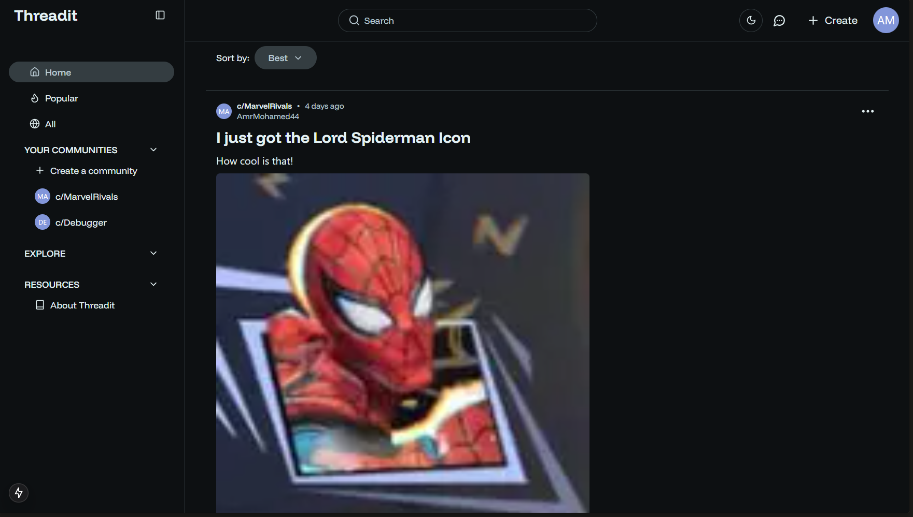

# Threadit

 

A full-stack Reddit clone built with Node.js, GraphQL, Apollo for the backend, and Next.js for the frontend and Typescript on both.



## 📋 Table of Contents

- [Threadit](#threadit)
  - [📋 Table of Contents](#-table-of-contents)
  - [🚀 Project Overview](#-project-overview)
  - [📝 Why I built this?](#-why-i-built-this)
  - [🏗️ Architecture](#️-architecture)
  - [✨ Features](#-features)
    - [Prerequisites](#prerequisites)
    - [Backend Setup](#backend-setup)
  - [🔄 API Documentation](#-api-documentation)
    - [API Endpoint](#api-endpoint)
    - [Authentication](#authentication)
    - [GraphQL Schema Explorer](#graphql-schema-explorer)
    - [Core Functionality](#core-functionality)
      - [User Management](#user-management)
      - [Posts](#posts)
      - [Further Resources](#further-resources)
    - [Error Handling](#error-handling)
  - [🚀 Deployment](#-deployment)
  - [⚡ Performance](#-performance)
  - [🤝 Contributing](#-contributing)
  - [📬 Contact](#-contact)
  - [� License](#-license)

## 🚀 Project Overview

This is the backend repository of a full-stack, fully functional Reddit clone with many features such as user authentication, CRUD operations on posts, comments and communities, and more.

## 📝 Why I built this?

I wanted to create a full-stack project using technologies that I am not familiar with and learn about them, such as GraphQL and Websockets. I also wanted to explore the capabilities of the technologies I was using, and see how they could be used to build a real-world application.

## 🏗️ Architecture

-**Tech Stack**:

- Node.js using Express to create the API
- PostgreSQL using Supabase for efficient relational database management
- DrizzleORM for database migrations and access in code using an intuitive SQL-like syntax
- GraphQL using Apollo Server for flexible API design and performance
- TypeGraphql for type safety and auto-completion across the entire project
- Zod for environment variables validation
- JWT for authentication and authorization
- Websockets for real-time communication
- Redis for caching, subscribing and publishing real-time events

-**Repository**: [Github Repository](https://github.com/AmrMohamed27/threadit-server)

## ✨ Features

- User Authentication using JWT tokens stored in local storage, and email confirmation and password reset functionality using Nodemailer.
- Data stored in PostgreSQL using Supabase and DrizzleORM.
- Authenticated users can create, read, update, and delete posts and comments, and create and join communities.
- Posts and comments can be upvoted and downvoted, and users can save or hide posts.
- Posts can contain images, and videos -which are uploaded using Uploadthing API-, and are creating using markdown to support formatting e.g. bold and italics.
- Users can edit their profile information, Add a profile picture, and view their own profile and other users' profiles.
- Users can start direct chats with other users, or create group chats with multiple users, where they can send real-time messages using websockets and GraphQL subscriptions, including text and images uploaded using Uploadthing API.
- Ability to search for posts, users and communities, and search through comments.
- Ability to sort posts and comments by date, popularity, and relevance, along with pagination for all queries to maximize performance.
- Support for threaded comments, allowing users to reply to comments and view the entire conversation, and collapse or expand the thread.

### Prerequisites

- Node.js (v14+)
- npm or yarn
- PostgreSQL
- Redis

### Backend Setup

```bash

# Clone the repository

git clone https://github.com/AmrMohamed27/threadit-server


# Navigate to the project directory

cd server


# Install dependencies

npm install


# Configure environment variables

cp .env .example.env

# Edit .env with your configuration


# Start the development server, note that this command runs both the tsc watch command and the nodemon command

npm run dev:all

```

## 🔄 API Documentation

### API Endpoint

The GraphQL API is accessible at: [http://localhost:4000/graphql](http://localhost:4000/graphql) if you are running the project locally, and on [https://mini-message-app-u765.onrender.com/graphql](https://mini-message-app-u765.onrender.com/graphql) if you are accessing the deployed version on Render.

### Authentication

- This API uses JWT (JSON Web Token) authentication. Include the JWT token in your Authorization header for protected routes:

  ```bash

  Authorization: Bearer <your_jwt_token>

  ```

- Authentication tokens can be obtained through the `login` mutation

### GraphQL Schema Explorer

You can explore the full API schema using:

- Apollo Studio Playground available at [http://localhost:4000/graphql](http://localhost:4000/graphql) in development mode

### Core Functionality

#### User Management

```graphql

mutation Register($userData: RegisterInput!) {

  registerUser(userData:$userData) {

    ...SingleUserResponse

  }

}

mutation Login($userData: LoginInput!) {

  loginUser(userData:$userData) {

    ...SingleUserResponse

  }

}

fragment FullUser onUser {

  id

  name

  email

  image

  createdAt

  updatedAt

  confirmed

}

fragment SingleUserResponse onUserResponse {

  user {

    ...FullUser

  }

  errors {

    ...FullErrorField

  }

  count

  token

}

```

#### Posts

```graphql

query GetAllPosts($options: GetAllPostsInput!) {

  getAllPosts(options:$options) {

    ...FullPostResponse

  }

}

mutation CreatePost($options: CreatePostInput!) {

  createPost(options:$options) {

    post {

      ...FullPost

    }

    errors {

      ...FullErrorField

    }

  }

}

fragment FullPost onPost {

  id

  title

  content

  createdAt

  updatedAt

  authorId

  communityId

  media

  video

}


fragment FullPostResponse onPostResponse {

  postsArray {

    ...FullPost

    upvotesCount

    isUpvoted

    commentsCount

    author {

      ...FullAuthor

    }

    community {

      ...FullCommunity

    }

  }

  errors {

    ...FullErrorField

  }

  count

}

```

#### Further Resources

For the complete schema definition and available operations, please refer to the GraphQL Playground or Apollo Studio Explorer.

### Error Handling

The API returns errors in the following format:

```json

{

  "errors": [

    {

      "field": "field_name",

      "message": "error_message"

    }

  ]

}

```

For example, if you try to create a post without a title, you will receive the following error:

```json

{

  "errors": [

    {

      "field": "title",

      "message": "Title is required"

    }

  ]

}

```

This allows to easily handle errors in the client-side code.

## 🚀 Deployment

-**Backend API**: [https://mini-message-app-u765.onrender.com](https://mini-message-app-u765.onrender.com)

## ⚡ Performance

This application is designed with performance in mind:

- All GraphQL queries support pagination to minimize data transfer
- Apollo automatically caches query results to reduce server load
- GraphQL subscriptions for real-time messaging and chat functionality

## 🤝 Contributing

Contributions are welcome! If you'd like to contribute to this project, please follow these steps:

1. Fork the repository
2. Create a new branch (git checkout -b feature/amazing-feature)
3. Make your changes
4. Commit your changes (git commit -m 'Add some amazing feature')
5. Push to the branch (git push origin feature/amazing-feature)
6. Open a Pull Request

## 📬 Contact

If you have any questions or would like to discuss this project, please feel free to reach out:

- GitHub: [@AmrMohamed27](https://github.com/AmrMohamed27)
- Email: [amrmohamed2766@gmail.com](mailto:amrmohamed2766@gmail.com)
- LinkedIn: [Amr Mohamed](https://www.linkedin.com/in/amrmohamed27/)

## 📝 License

This project is licensed under the MIT License.
